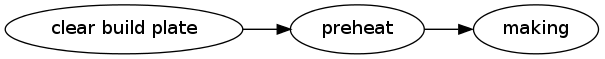

# Machine Thread

conveyor allocates a thread for each machine it is managing.
The threads follow this state machine:

## States

A machine thread can be in one of five states:

### Idle

In the idle state the machine is not performing any action (although it may be preheating).

### Busy

A machine thread enters the busy state when the user performs some action with the machine's display board.
Actions that put the machine into the busy state:

  * make from SD
  * change filament
  * level build plate
  * jog
  * TODO: are there more actions?

Some of these actions are also available through the conveyor command-line and MakerWare user interface.
The state machine uses the "busy" state when these actions are run from the machine's display board and the "task" state when they are run from conveyor or MakerWare.

### Making

The machine is making an object.
Internally this follows a second state machine:

Pause is not included in this second state machine because it can happen at any point in the process (and this turns the DFA into a PDA).

### Paused

The machine is making an object but is currently paused.

### Task

The machine is performing an action that was initiated through the conveyor command-line client or MakerWare.
Actions that put the machine into the task state:

  * firmware upload
  * change filament
  * jog

Some of these actions are also available through the display board.
The state machine uses the "task" state when these actions are run from conveyor or MakerWare and the "busy" state when they are run from the machine's display board.

### Canceling

The main purpose of this state is to let the machine thread account for actions necessary to cancel a print or task.
For example, when a print is canceled the machine needs several seconds to lower the build plate.

Not all tasks can be canceled.
In particular, there is no way to cancel firmware upload (it would leave the machine in an unusable state).

conveyor will automatically issue an 'M:went-idle' event once the cancellation is complete.
At that point, the machine may stay in the idle state or it may move immediately to the busy state if an 'M:went-busy' event condition is detected.

## Events

### Machine Events

These events are issued either by the machine or by conveyor as it finishes some action.
They are never issued as a direct result of a user action although they are issued when some user-initiated actions finish.
They are prefixed with an "M".

#### M:went-busy

This event is issued by the machine when the user performs an action using the display board.
conveyor never issues this event.

#### M:went-idle

This event is issued by the machine when the user ends a display board action or when conveyor finishes some action.

### Command Events

These events are issued by conveyor in response to a user request.
They are prefixed with a "C".

#### C:start-making

This event is issued when the user wants to make a 3D object.

#### C:pause

This event is issued when the user wants to pause a print that is currently running.

#### C:unpause

This event is issued when the user wants to resume a paused print.

#### C:start-task

This event is issued when the user wants to run a non-printing task.
The set of supported tasks is:

  * firmware upload
  * change filament
  * jog

#### C:cancel

This event is issued when the user wants to cancel a print or task.

<!-- vim:set ai et fenc=utf-8 ff=unix sw=4 syntax=markdown ts=4: -->
