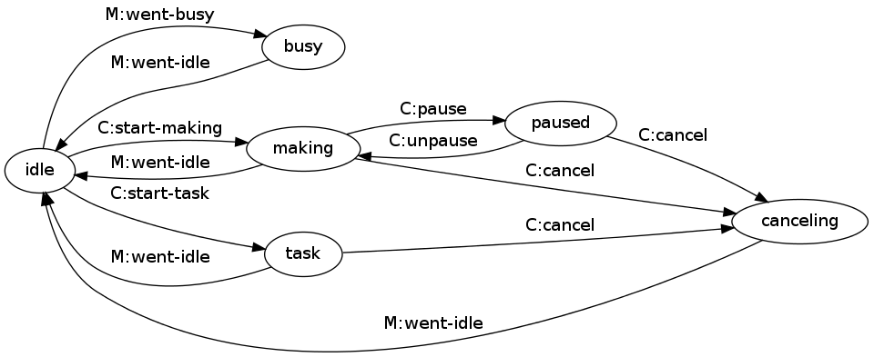

# Machine Thread

conveyor allocates a thread for each machine it is managing.
These threads follow this state machine:

conveyor actually allocates a second thread for each machine.
The second thread polls the status of the pysical machine and generates certain events ("went-busy", "went-idle", and "disconnected").

## Operations

### Display Board Operations

These are the operations that are available from the machine's display board:

  * make from SD
  * change filament
  * level build plate
  * jog

### conveyor and MakerWare Operations

These are the operations that are available from conveyor and MakerWare:

  * make
  * change filament
  * jog
  * read or write EEPROM
  * write firmware

## States

A machine thread can be in one of five states:

### Disconnected

The machine thread is in the disconnected state when it first starts.
The disconnected state can be entered from every other state: the machine can be disconnected (i.e. physically, by turning the machine off or unplugging the USB cable) or by a user-initiated "disconnect" action available from conveyor or MakerWare.

### Busy

The machine thread is in the busy state when it first connects and whenever the machine itself indicates that it is busy.
The busy state can be entered from every other state.

Conditions that put the machine into the busy state:

  * power on
  * reset

Display board operations that put the machine into the busy state:

  * make from SD
  * change filament
  * level build plate
  * jog

Some of these operations are also available through the conveyor command-line and MakerWare user interface.
The state machine uses the "busy" state when these operations are run from the machine's display board and the "operation" state when they are run from conveyor or MakerWare.

The machine thread also enters this state whenever it is in the "operation" state its current operation ends normally, by failure, or if it is canceled.
In all three cases the machine will naturally return to the "idle" state once it is ready to accept new commands.
This should be almost immediate for when an operation ends normally.
For cancellations and recoverable failures it will return to "idle" once step motor motion ends and the communication buffer is empty.

### Idle

In the idle state the machine is not performing any operation (although it may be preheating).

### Operation

The machine thread is running some operation on the physical machine in response to a request by conveyor or MakerWare (as opposed to the user running a similar operation from the machine's display board).

  * make
  * change filament
  * jog
  * upload firmware
  * read or write settings (EEPROM)

Some of these operations are also available through the conveyor command-line and MakerWare user interface.
The state machine uses the "operation" state when these operations are run from conveyor or MakerWare and the "busy" state when they are run from the machine's display board.

### Paused

The machine thread is running some operation on the physical machine but that operation is paused.
Only the "make" operation is pausable.

## Events

### Connect

This event is issued when a user requests by conveyor or MakerWare to connect a machine.
It is only issued when the machine thread is in the "disconnected" state.

### Disconnect

This event is issued when a user requests by conveyor or MakerWare to disconnect a machine.
It can be issued from any state other than "disconnected".
"disconnect" and "disconnected" are separate events so that the machine thread can perform error handling for the "disconnected" event.

### Disconnected

This event is issued when the machine disconnects unexpectedly.
It can be issued from any state other than "disconnected".
"disconnected" and "disconnect" are separate events so that the machine thread can perform error handling for the "disconnected" event.

### Went Idle

This event is issued when the machine is ready to accept new commands.
It is only issued when the machine is in the "busy" state.

### Went Busy

This event is issued when the machine is first connected or when it is busy as defined above.
It can be issued from any state other than "disconnected".

### Start Operation

This event is issued when a user requests by conveyor or MakerWare to start some operation.
It is only issued when the machine thread is in the "idle" state.

### Pause Operation

This event is issued when a user requests by conveyor or MakerWare to pause the current operation.
It is only issued when the machine thread is in the "operation" state.
Only the "make" operation is pausable.

### Unpause Operation

This event is issued when a user requests by conveyor or MakerWare to unpause the current operation.
It is only issued when the machine thread is in the "paused" state.
Only the "make" operation is pausable.

### Operation Stopped

This event is issued when an operation stops normally, by failure, or if it is canceled.
It is only issued when the machine thread is in the "operation" state.

<!-- vim:set ai et fenc=utf-8 ff=unix sw=4 syntax=markdown ts=4: -->
