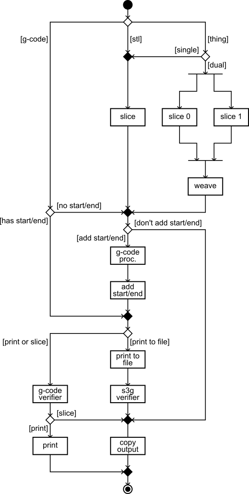

# conveyor Unified Recipe

## --add-start-end and --has-start-end

The `--add-start-end` and `--has-start-end` options are used when slicing a model to an intermediate G-code file and then later printing (to either a machine or file) that intermediate G-code file.
These options have no effect when a model is printed without generating an intermediate G-code file for the user.

The `--add-start-end` option tells the `slice` command to run the G-code processors on the file and then add the start/end G-code to the file.

The `--has-start-end` option is the complement to `--add-start-end`.
It tells conveyor that the G-code file was previously generated with the `--add-start-end` option.
It prevents conveyor from running the G-code processors on the file a second time and from adding a second copy of the start/end G-code to the file.

In all circumstances conveyor overrides your slicer configuration (default or custom) so that the slicer does not itself generate start/end G-code.
The start/end G-code is always handled by the `"add start/end"` task in conveyor's recipe.
The `--add-start-end` and `--has-start-end` determine whether or not that task runs (along with its associated `"g-code processor"` task).

### Advice

If you produce a G-code file with `--add-start-end` then you must print it with `--has-start-end`.
This is the simplest (and recommended) way to produce and then print an intermediate G-code file.

        $ python -m conveyor.client slice --add-start-end 20mm_Calibration_Box.stl 20mm_Calibration_Box.gcode
        $ python -m conveyor.client print --has-start-end 20mm_Calibration_Box.gcode

If you produce a G-code file without `--add-start-end` then you must print it without `--has-start-end`.
You should also use the same `--slicer` and `--slicer-settings` arguments (although either of these values can be the default).
The reason is that conveyor uses your slicer configuration to determine what start/end G-code to add to the file even if it isn't actually running the slicer.

        $ python -m conveyor.client slice --slicer skeinforge --slicer-settings CustomProfile 20mm_Calibration_Box.stl 20mm_Calibration_Box.gcode
        $ python -m conveyor.client print --slicer skeinforge --slicer-settings CustomProfile 20mm_Calibration_Box.gcode

### Effective Values for --add-start-end and --has-start-end

During the execution of the recipe the decisions for `add start/end` and `has start/end` are made using the *effective* `add start/end` and `has start/end` values instead of using the values specified by the user.
The effective values are determined by inspecting the command, input file type, and whether or not the `--add-start-end` or `--has-start-end` flags are passed.

In short, the effective values ensure that `--add-start-end` is only applicable when slicing to G-code and `--has-start-end` is only applicable when printing (to either a machine or file) from a G-code file.

The effective value for `add start/end` is computed as follows:

  1. If the command is `slice` and the `--add-start-end` option was specified then the effective value of `add start/end` is `TRUE`
  2. Otherwise the effective value of `add start/end` is `FALSE`.

The effective value for `has start/end` is computed as follows:

  1. If the command is `print` or `printtofile` and the input file is G-code and the `--has-start-end` option was specified then the effective value of `has start/end` is `TRUE`.
  2. Otherwise the effective value of `has start/end` is `FALSE`.

## --extruder

The `--extruder` option tells conveyor which extruders are in use.
Three values are available:

<table>
  <thead>
    <tr>
      <th>Command-Line</th>
      <th>JSON</th>
    </tr>
  </thead>
  <tbody>
    <tr>
      <td>right</td>
      <td>0</td>
    </tr>
    <tr>
      <td>left</td>
      <td>1</td>
    </tr>
    <tr>
      <td>both</td>
      <td>0,1</td>
    </tr>
  </tbody>
</table>

The default is `right/0`.

This value is particularly important when printing (to either a machine or file) an intermediate dualstrusion G-code file that has no start/end G-code.
In that case it must be set to `both/0,1` because conveyor has no way to detect a dualstrusion G-code file.
It will not run the correct set of G-code processors or emit the correct start/end G-code on the file otherwise.

### Effective value for --extruder

Much like the `--add-start-end` and `--has-start-end` options, conveyor uses an *effective* value for `--extruder`.
It is computed as follows:

  1. If the input file is a dual `.thing` file then the effective value of `--extruder` is `both/0,1`.
  2. Otherwise the effective value of `--extruder` is the value specified by the user.

The effective value for `--extruder` controls several things:

  1. the `defaultExtruder` property for the default Miracle Grue slicer settings
  2. whether or not the dualstrusion G-code processors are included in the default list of G-code processors
  3. which toolheads are activated by the driver/profile's start/end G-code.
